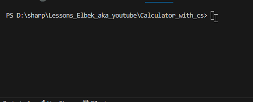

# Calculator
 

This project shows how I can learn C#

Have a look `Program.cs` file and you can see how I have used:

* Console input/output
* Conversion between data types
* Arithmetic operations

## Demo

